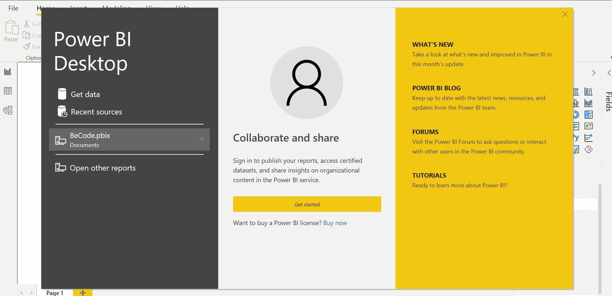
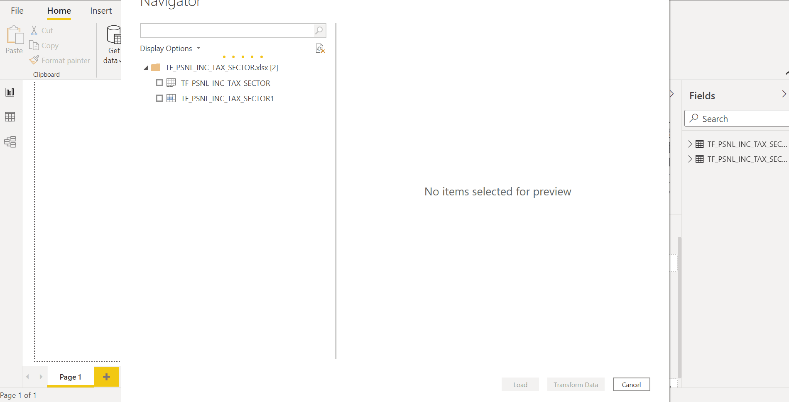
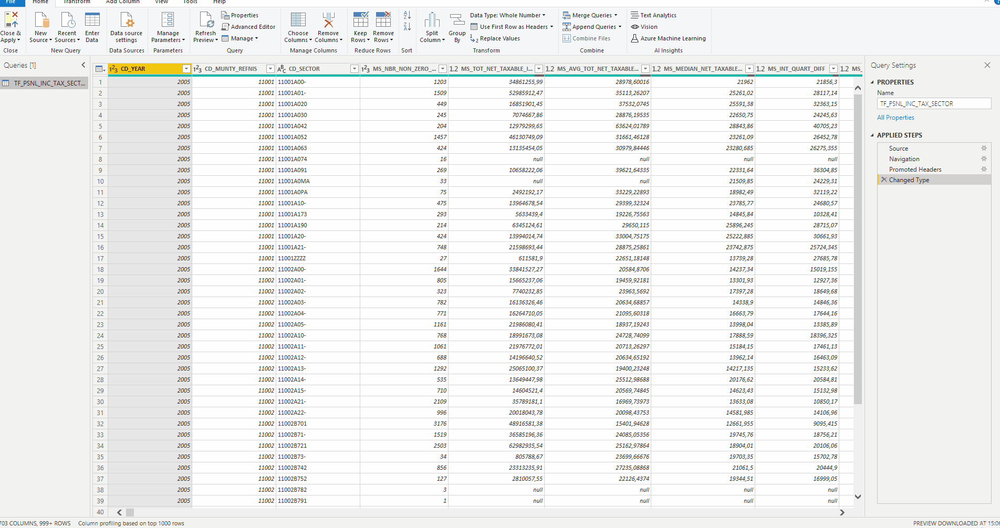
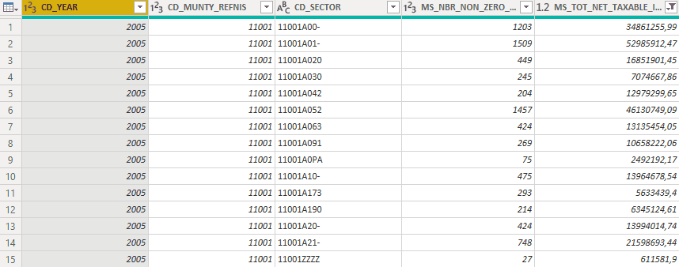
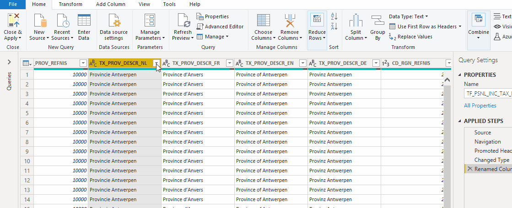
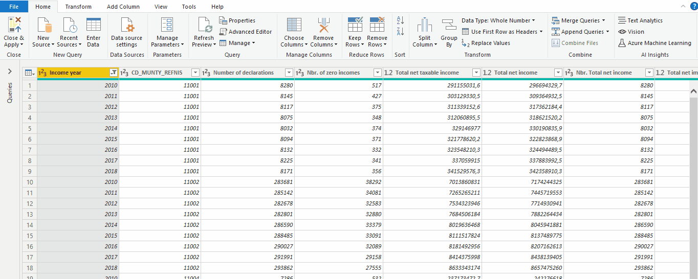

# Getting Started

You are a Data Scientist working for an international company interested on a report to describe Belgium's economy from a fiscal perspective, the data is publicly available but it's hard to find insights by looking at thousands of data points storaged on an excel file. 

Your mission is to build appealing visuals providing meaningful information that can help a CEO to take decisions by looking at the dashboard whiles he takes the coffee in the morning.

## Getting the data 

For this exercise, we will use a previously downloaded datasets of:

- Fiscal statistics on income by Statistical sector:  [TF_PSNL_INC_TAX_SECTOR.xlsx](./data/TF_PSNL_INC_TAX_SECTOR.xlsx)
- Fiscal statistics on income: [TF_PSNL_INC_TAX_MUNTY.xlsx](./data/TF_PSNL_INC_TAX_MUNTY.xlsx) 

Both from the [STATBEL](https://statbel.fgov.be/en/open-data/) platform. 

For obtaining a detail description of the information contained on the dataset, download the meta-data associated to the file:

[Meta-data: Variables](./data/Columns%20descriptions%20(partial).xlsx)

## Open Power BI and load the dataset

You can load several data formats such as `.csv` or connect to `SQL` databases. For the purpose of this exercise, we will work with an `.xlsx` file since it's the original format provided to us.

## Load and transform dataset

This is a fundamental step for building your dashboard, if your dataset is previously processed and the the necessary features calculated with loading the data is enough to start developing. However, we know that datasets need continuous processing to get the insights we are looking for and usually the data is not perfect, reason for why some transformations might be needed.

- Select the tables of interest
- You can click on `Load` the dataset if changes are not needed
- You can click on `Transform Data` if the tables need pre-processing before building the visuals

For the next step, click on `Transform Data`.

## Query Settings

On the menu for transforming data, you will see on the left side the panel corresponding to `Query Settings` this menu will show the several steps applied to transform the dataset  and are executed every time the project is open or new data is uploaded.

_Note: If you wish your new data to be transform following the `applied steps`, the new dataset must contain the same number of columns, order and name of columns, otherwise the system will indicate errors during the process of transforming data_

## Hands-on to transform data

While you are on the `Power Query Editor`, explore the columns in both files and try to spot possible values that might reduce the quality of your data.

Can you notice there are several columns including `null` values?

**1. Filter values**

- Find the columns with null values (_if existing_) and filter the information to avoid including these data-points on our dashboard.

- Go to the column `CD_YEAR` and filter the values to display data points collected from 2010 for the `TF_PSNL_INC_TAX_MUNTY.xlsx` files.

**2. Change the name of columns**

- Now, in the `TF_PSNL_INC_TAX_MUNTY.xlsx` file, change the name of the column `CD_YEAR` by `Income Year`
- Try out changing other column names for others that describe better the data (follow the description available on `Metadata: Variables`)
- Can you infer the names of the remaining colums? Picking names that are descriptive will help you in the next steps!

**3. Remove columns**

After exploring the name of several columns you might have noticed that some of the columns contain exactly the same information but on different languages (FR, NL, DE and EN).

- Remove the columns with information in FR, NL and DE, our dashboard is being designed for an international company where the majority of consultants are English speakers.

**4. Add new columns and perform operations**

Until now, we have done small changes on the original dataset but sometimes extra calculations might be necessary for extracting insights on our data.

- Add a new column `Avg. Net income by declaration` that calculates the mean net income by habitant by using the `Custom Column` feature under `Add Column`.
- Add another new column `Avg. Net taxable income by declaration` that calculates the mean net taxable income by declaration.

**5. Find insights on your dataset.**

As a Data Science or Data Analyst, your mission is to find insights that could help decision makers to make improvements on their product or service.

Imagine for a moment that this dataset is a person, an expert that remember every number behind tax declarations on the country. What questions would you ask to have a better description of the fiscal picture in Belgium ? 

**For example:**

- What is the average income by habitant in Belgium ?
- What percentage of the population have filled a tax declaration ?
- What percentage of the population has declared zero income ?
- In what municipalities the habitants are reporting higher income? Why?

Crunching these numbers from the available information on the dataset, could help you to build a bigger picture of the economy of Belgium.

- Add a new column `Avg.Total income` representing average income by habitant.
- Add a new column `% Declarations` representing the percentage of the population that have filled a tax declaration
- Add a new column `% zero income` representing the percentage of the population that has declared zero income

Now, do a quick check! Do the values of you new columns match what you would expect?

Well done, you have completed several steps to transform your data, now click on `Close & Apply` under `File` and get ready for building your first visuals.

**6. Ask some additional questions**

After finishing the task above, write down at least 3 other questions you'd like to answer with this dataset! 

At the end of the day, these are the questions that will set you apart as a data analyst.

# [Next step](./03.First_dashboard.md)
